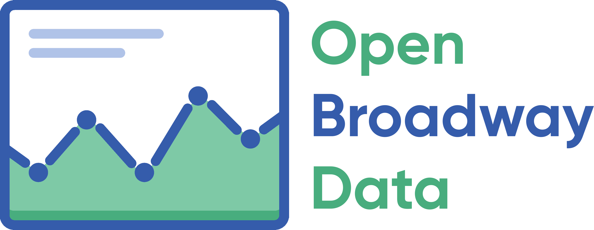

<link rel="stylesheet" href="/assets/css/styles.css">
<link rel="stylesheet" href="{{ "/assets/css/main.css, " | prepend: site.baseurl }}">

# Open Broadway Data – Archive Site
The project is currently archived (limited ongoing development), however, you can still access a whole bunch of data here
and learn about this project's history, purpose, successes, and challenges.

### About Open Broadway Data
Open Broadway Data is an open source & open data platform which aims to collect, display, and analyze data from all Broadway shows
since 1738 with the ultimate goal of helping researchers, activists, and journalists make Broadway the best it can be.

[Get in touch](/contact/.html)
